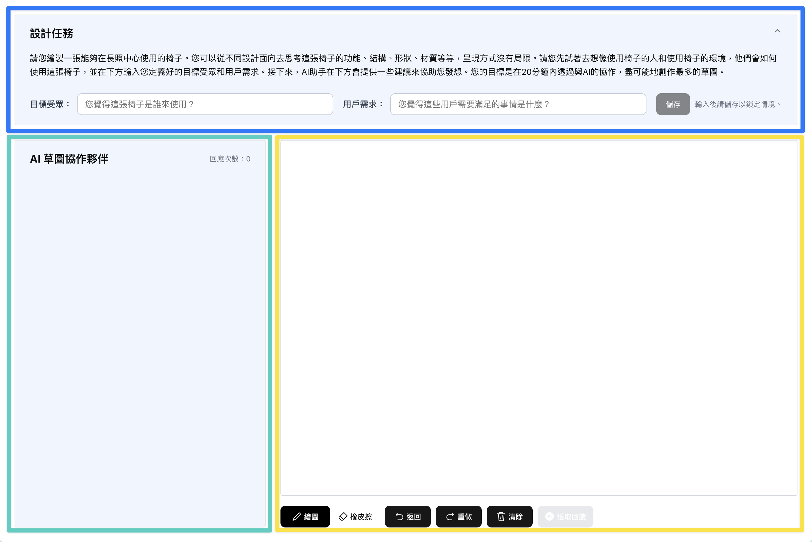
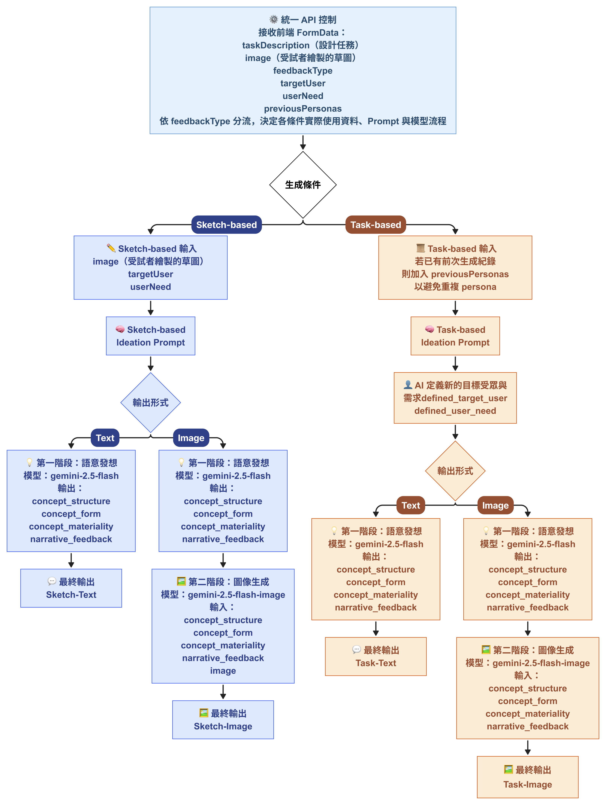
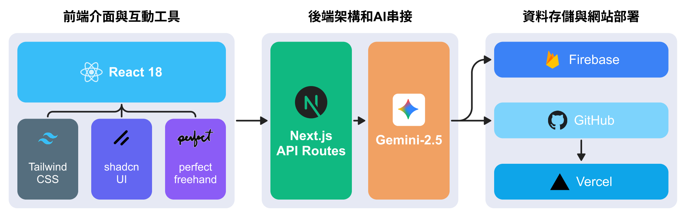

# AI Sketching Partner

生成式 AI 草圖合作系統，支援設計受試者在同一個網頁中完成「閱讀任務、設定目標受眾與需求、手繪草圖、取得 AI 回饋、查看創作歷程」等流程。這個專案主要用於碩士論文實驗，目標是比較不同 AI 回饋形式對草圖發想與設計迭代的影響。

網站連結：[ai-sketching-partner.vercel.app](https://ai-sketching-partner.vercel.app/)

## 專案目標

這套系統把「AI 給設計建議」拆成可控制的實驗條件，讓每位受試者在固定任務中繪製草圖，並依照被分派的條件收到不同形式的 AI 回饋。系統會記錄草圖、AI 回饋、作畫時間、工具切換次數與創作歷程，方便後續研究分析。

## 核心功能

- 受試者登入：輸入受試者 ID，系統會建立或讀取既有實驗紀錄。
- 四種 AI 回饋模式：支援草圖導向與任務導向，也支援文字與圖像兩種輸出。
- 線上草圖畫布：使用滑鼠繪製，支援筆刷、橡皮擦、復原、重做與清除。
- AI 回饋生成：根據實驗條件，把任務描述、目標受眾、使用者需求與草圖送到 Gemini API。
- 創作歷程視窗：回看每一輪草圖與前一輪 AI 建議，方便理解受試者如何被回饋影響。
- 實驗資料保存：將草圖圖片、AI 生成圖、回饋內容與時間資料存到 Firebase。

## 四種實驗條件

| 條件 | AI 參考資料 | AI 輸出形式 | 用途 |
| --- | --- | --- | --- |
| 草圖文字建議 | 受試者目前草圖 | 文字建議 | 讓 AI 根據已畫出的草圖，給下一輪可延伸的方向。 |
| 草圖圖像建議 | 受試者目前草圖 | 參考圖像 | 讓 AI 根據草圖生成新的視覺發想，作為下一張草圖的刺激。 |
| 任務文字發想 | 設計任務描述 | 文字建議 | 讓 AI 不看草圖，只根據任務補充新的使用者情境與概念方向。 |
| 任務圖像發想 | 設計任務描述 | 參考圖像 | 讓 AI 不看草圖，直接根據任務生成新的視覺參考。 |


圖：四種 AI 回饋條件的資訊來源與輸出差異。系統透過「是否讀取草圖」與「輸出文字或圖像」兩個維度，建立可比較的實驗組別。

這張圖整理了本研究最核心的實驗設計。四個條件不是單純換 UI 顏色或按鈕文字，而是控制 AI 在生成回饋時能看到哪些資訊：有些條件會讓 AI 讀取受試者當前草圖，有些條件只讓 AI 依照設計任務發想；輸出也分成文字建議與圖像參考。透過這樣的拆分，後續可以比較「AI 是否參考草圖」以及「AI 用文字或圖片回饋」對受試者草圖迭代的影響。

在系統中，這四種條件對應到登入前選擇的 AI 回饋模式。受試者一旦選定模式，後續每一輪送出草圖時都會維持同一種回饋邏輯，確保實驗資料可以被穩定比較。

## 系統介面



圖：系統主要介面。左側提供設計任務、目標受眾與需求輸入；中間是草圖畫布與繪圖工具；右側顯示 AI 建議、回饋狀態與創作歷程。

這張圖說明受試者實際操作系統時看到的主要畫面。介面被分成三個區域：左側是任務與設計情境，讓受試者先理解要設計什麼，並輸入自己設定的目標受眾與使用者需求；中間是主要繪圖區，提供鉛筆、橡皮擦、復原、重做、清除等基本草圖工具；右側是 AI 回饋區，會依照受試者所屬的實驗條件顯示文字建議或圖像建議。

這樣的版面安排是為了讓受試者在同一個畫面中完成「閱讀任務、畫草圖、收到回饋、再畫下一張」的循環，不需要切換工具或離開實驗頁面。系統也提供創作歷程視窗，讓研究者可以回看每一輪草圖與 AI 回饋之間的關係。

## AI 回饋後端邏輯



圖：不同實驗條件會走不同資料流程。草圖導向模式會把畫布裁切後的 PNG 一起送入 Gemini；任務導向模式只使用任務與情境文字。若條件需要圖像輸出，系統會再呼叫圖像生成模型產生參考圖。

這張圖拆解了「按下獲取回饋」之後，後端實際怎麼判斷要產生哪一種 AI 回饋。系統會先根據受試者的 `feedbackType` 判斷目前是哪個實驗條件。如果是草圖導向模式，前端會把畫布內容裁切成 PNG，連同任務描述、目標受眾與使用者需求一起送到 API；如果是任務導向模式，AI 不會讀取草圖，只會根據設計任務與情境生成新的發想方向。

文字條件會回傳結構化 JSON，再由前端整理成一段受試者看得懂的建議。圖像條件則會先產生設計概念，再把概念轉成圖像生成 prompt，產生一張新的草圖參考。這個流程讓四種條件在資料來源與輸出形式上保持清楚差異，也避免不同實驗組混到不該看到的資訊。

## 系統架構



圖：前端使用 Next.js 與 React 建立實驗介面，Canvas 負責草圖輸入；後端 API Route 負責組 prompt、呼叫 Gemini API 並整理回饋；Firebase Storage 保存草圖與 AI 圖像，Firestore 保存每輪回饋與實驗時間資料。

這張圖說明整套系統如何串起前端、AI 模型與資料庫。前端由 Next.js 和 React 組成，受試者在瀏覽器中完成登入、設定需求、繪製草圖與查看回饋。畫布資料會在送出時被轉成圖片，交給後端 API Route 處理。

後端主要負責三件事：第一，依照實驗條件組出不同 prompt；第二，呼叫 Gemini API 產生文字或圖像回饋；第三，把回饋整理成前端可顯示、研究者可分析的格式。資料保存則分成兩層：Firebase Storage 存放受試者草圖與 AI 生成圖，Firestore 存放每一輪的文字回饋、模式、受試者 ID、作畫時間、AI 回應時間與工具切換次數。這讓研究者不只看得到最後結果，也能追蹤每輪創作過程。

## 技術架構

- Framework：Next.js 14、React 18
- Styling：Tailwind CSS、shadcn/ui、Radix UI
- Drawing：Canvas、perfect-freehand
- AI：Google Gemini API
- Storage：Firebase Storage
- Database：Cloud Firestore
- Deployment：Vercel

## 本機執行

```bash
npm install
npm run dev
```

開啟 [http://localhost:3000](http://localhost:3000) 查看系統。

## 環境變數

請建立 `.env.local`，並填入以下變數：

```bash
GOOGLE_API_KEY=
NEXT_PUBLIC_FIREBASE_API_KEY=
NEXT_PUBLIC_FIREBASE_AUTH_DOMAIN=
NEXT_PUBLIC_FIREBASE_PROJECT_ID=
NEXT_PUBLIC_FIREBASE_STORAGE_BUCKET=
NEXT_PUBLIC_FIREBASE_MSG_SENDER_ID=
NEXT_PUBLIC_FIREBASE_APP_ID=
```

## 專案定位

這不是一般公開產品，而是研究用實驗系統。設計重點不只在介面操作，也包含可控的實驗條件、資料保存、歷程追蹤與回饋內容一致性，讓後續能比較生成式 AI 在草圖發想中的不同協作方式。
